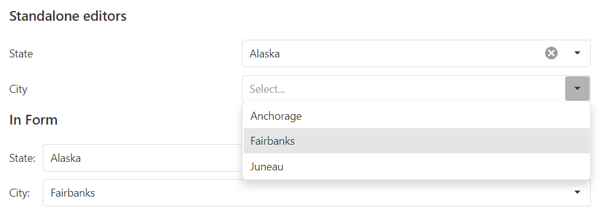

<!-- default badges list -->

<!-- default badges end -->

# SelectBoxes for DevExtreme - How to implement standalone and in-Form cascading SelectBoxes

This example demonstrates how to implement cascading SelectBoxes in the following scenarios:

- standalone SelectBoxes
- SelectBoxes in Form

When you select a value from the first SelectBox, the values from the second SelectBox should be filtered. In this example, when you select a state only the cities from this state appear in the second SelectBox.

To implement this, get a changed [value](https://js.devexpress.com/Documentation/ApiReference/UI_Components/dxSelectBox/Configuration/#value) from the first editor and [filter](https://js.devexpress.com/Documentation/ApiReference/Data_Layer/DataSource/Methods/#filter) the [dataSource](https://js.devexpress.com/Documentation/ApiReference/UI_Components/dxSelectBox/Configuration/#dataSource) by this **value** in the second editor so it shows relevant items.

## Files to Look At

- **jQuery**
    - [index.html](jQuery/index.html)
- **Angular**
    - [app.component.html](Angular/src/app/app.component.html)
    - [app.component.ts](Angular/src/app/app.component.ts)
- **Vue**
    - [App.vue](Vue/src/App.vue)
- **React**
    - [App.js](React/src/App.js)
- **NetCore**    
    - [Index.shtml](NetCore/CascadingSelectBoxesSample/Views/Home/Index.cshtml)

## Documentation

- [Getting Started with SelectBox](https://js.devexpress.com/Documentation/Guide/UI_Components/SelectBox/Getting_Started_with_SelectBox/)

- [SelectBox - API Reference](https://js.devexpress.com/Documentation/ApiReference/UI_Components/dxSelectBox/)

## More Examples

- [DataGrid for DevExtreme - How to implement cascading DropDownBoxes](https://github.com/DevExpress-Examples/DataGrid---How-to-implement-cascading-dropdownboxes)